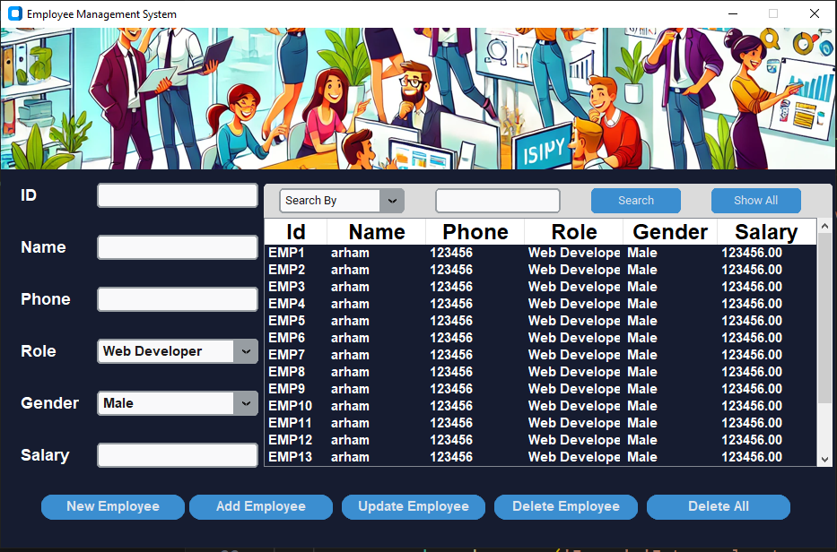

Here is a detailed and professional `README.md` for your **Employee Management System** project using `customtkinter`, `pymysql`, and `PIL`:

---

# 🧑‍💼 Employee Management System (EMS) using Python

A modern, responsive **Employee Management System** built with `customtkinter` for UI and `MySQL` as the backend database. It allows you to **add**, **view**, **search**, **update**, and **delete** employee records, including powerful features like role filtering and gender-based classification—all in a dark, stylish GUI.

---

## 📸 Preview

 <!-- Replace with actual screenshot file or remove this section if not available -->

---

## 📂 Project Structure

```
📁 Employee-Management-System
├── database.py              # Handles all MySQL database operations
├── main.py                  # Main GUI application
├── ss.png                   # App screenshot image
├── README.md                # Project documentation
```

---

## ⚙️ Features

* 🔐 **Add New Employee** with ID, Name, Phone, Role, Gender, and Salary
* 🆔 **ID Validation** (`EMP...` format)
* 🔍 **Search Employees** by any field (ID, Name, Phone, Role, Gender, Salary)
* 📝 **Update Employee** data dynamically
* ❌ **Delete Specific** or **All Records**
* 📜 **Auto-Refreshing Table** with all employee records
* 🎨 **CustomTkinter GUI** with modern themed interface
* 🔄 **Database Connection** using `pymysql`
* 🧠 **Predefined Roles & Genders** via dropdowns

---

## 🛠️ Technologies Used

| Library         | Use                          |
| --------------- | ---------------------------- |
| `customtkinter` | Modern Tkinter UI            |
| `pymysql`       | MySQL database connectivity  |
| `tkinter.ttk`   | Treeview for data table      |
| `PIL` (Pillow)  | Image support for background |

---

## 🧠 Skills Practiced

* GUI programming with `customtkinter`
* CRUD operations with `MySQL`
* Real-time updates and event handling
* Error handling and input validation
* OOP and code modularization (`database.py`)

---

## 🧰 How to Use

### 1. 🗄️ Prerequisites

Make sure you have:

* Python installed
* MySQL Server running locally (on `localhost`)
* Python packages installed:

```bash
pip install pymysql customtkinter pillow
```

### 2. 🧬 Setup

1. Replace the placeholder in `database.py`:

   ```python
   conn=pymysql.connect(host='localhost', user='root', password='---------')  # Replace with your MySQL password
   ```

2. Run the main application:

   ```bash
   python main.py
   ```

3. On first run, the following will automatically happen:

   * A database named `employee_data` will be created.
   * A table named `data` will be initialized if it doesn't exist.

---

## 🧾 ID Format Rule

The employee ID **must** start with `'EMP'` followed by a number (e.g., `EMP1`, `EMP002`). Any other format is rejected with a proper error message.

---

## 🗃️ Table Schema

```sql
CREATE TABLE data (
    Id VARCHAR(20),
    Name VARCHAR(50),
    Phone VARCHAR(15),
    Role VARCHAR(50),
    Gender VARCHAR(20),
    Salary DECIMAL(10,2)
);
```

---

## 🚀 Future Improvements

* 🔔 Add notification or sound when a new employee is added
* 💾 Export data to Excel or CSV
* 🛡️ Secure login screen for admin access
* 📊 Analytics dashboard for role/gender statistics

---

## 🧑‍🎓 Author

**Mian Arham Haroon**
Student of Computer Science
GitHub: [mian-arham-haroon](https://github.com/mian-arham-haroon)
Portfolio: [arham\_portfolio](https://mian-arham-haroon.github.io/arham_portfolio/)

---

## ❤️ Acknowledgements

* Thanks to `customtkinter` for the beautiful UI framework
* `MySQL` for robust backend storage
* Python community for documentation and support

---

Let me know if you'd like the `README.md` saved into a file, combined with other projects, or styled in Markdown for GitHub display.
